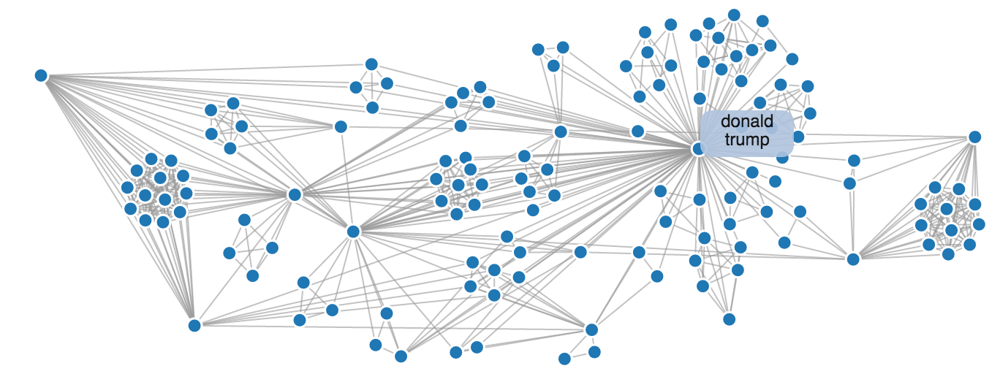

# Entity Extraction and Network Analysis
Or, how you can extract meaningful information from raw text and use it to analyze the networks of individuals hidden within your data set.

We are all drowning in text. Fortunately there are a number of data science strategies for handling the deluge. If you'd like to learn about using machine learning for this check out my [guide on document clustering](http://brandonrose.org/clustering). In this guide I'm going to walk you through a strategy for making sense of massive troves of unstructured text using entity extration and network analysis. These strategies are actively employed for legal e-discovery and within law enforcement and the intelligence community. Imagine you work at the FBI and you just uncovered a massive trove of documents on a confiscated laptop or server. What would you do? This guide offers an approach for dealing with this type of scenario. By the end of it you'll have generated a graph like the one above, which you can use to analyze the network hidden within your data set.

### Overview

We are going take a set of documents (in our case, news articles), extract entities from within them, and develop a social network based on entity document co-occurrence. This can be a useful approach for getting a sense of which entities exist in a set of documents and how those entities might be related. I'll talk more about using document co-occurrence as the mechanism for drawing an edge in a social network graph later.

In this guide I rely on 4 primary pieces of software:

1. Stanford Core NLP
2. Fuzzywuzzy
3. Networkx
4. D3.js

If you're not familiar with these libraries, don't worry, I'll make it easy to get off to the races with them in no time.

### Running the code
You should downoad and run `ner2sna.ipynb`. It will walk you through everything you need. You can use `corpus.txt` as a sample data set if you'd like. Also, make sure to capture the `force` directory when you try to run this on your own. You need `force/force.html`, `force/force.css`, and `force/force.js` in order to create the chart at the end of the guide.

If you have any questions for me, feel free to reach out on Twitter to [@brandonmrose](http://twitter.com/brandonmrose) or open up an issue on the github repo.